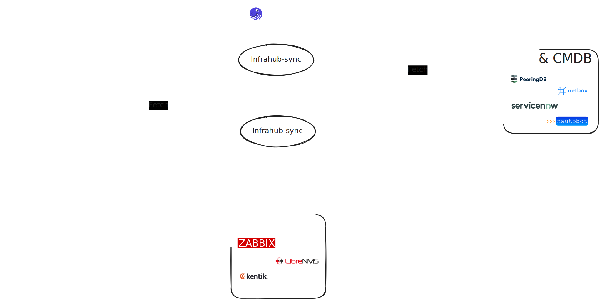

# Infrahub Orchestrator

The Infrahub Orchestrator leverages Dagster to orchestrate synchronization and diff operations between data sources such as Netbox and Nautobot, utilizing the Infrahub Sync framework. It defines a structured approach to managing and executing data synchronization tasks, ensuring data consistency across different platforms.



## Project Structure

```
.
├── Dockerfile_dagster
├── Dockerfile_orchestrator
├── README.md
├── dagster.yaml
├── docker-compose.yml
├── infrahub_orchestrator
│ ├── init.py
│ ├── job.py
│ ├── operation.py
│ ├── resource.py
│ └── schedule.py
├── poetry.lock
├── pyproject.toml
├── tests
│ └── init.py
└── workspace.yaml
```

This structure organizes the orchestrator's components, including Docker configurations, Dagster setups, and the orchestrator's core logic within the `infrahub_orchestrator` directory.

## Jobs and Operations

The orchestrator defines three main Dagster jobs to facilitate data synchronization, diff checking, and the dynamic generation of Python adapters and sync models based on configuration file or instance name.

### 1. `diff_job`
Compares data between sources to identify differences. Utilizes specific resources for configuration and execution settings.

### 2. `generate_job`
Builds the Python adapter and sync models for a given sync instance. This job automates the setup process for data synchronization by preparing the necessary code structure and dependencies.

### 3. `sync_job`
Synchronizes data between sources with an optional diff-checking feature. It can be configured at runtime to enable or disable diff analysis, providing flexibility in data management tasks.

## Configuration

### Sync Job Configuration

```sh
ops:
 sync_op:
  config:
   diff: True

resources:
 sync_instance_resource:
  config:
   config_file: /tmp/from-netbox/config.yml

 potenda_resource:
  config:
   branch: main
   show_progress: True
```

### Diff Job Configuration

```sh
resources:
 sync_instance_resource:
  config:
   config_file: /tmp/from-nautobot-v1/config.yml

 potenda_resource:
  config:
   branch: main
   show_progress: True
```

## Scheduling

The `sync_job` is scheduled to run every hour, between 09:00 AM and 04:59 PM GMT+1, from Sunday through Friday, using the following cron expression: `0 9-16 * * 0-5`.

## Getting Started

To run the orchestrator, ensure Docker and Docker Compose are installed on your system. Then, execute the following commands:

```sh
docker-compose build
docker-compose up -d
```

This will start the Dagster instance and the orchestrator, ready to execute the defined jobs based on the provided schedules or manual triggers through the Dagster UI.
